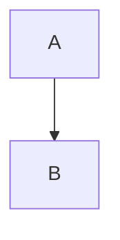
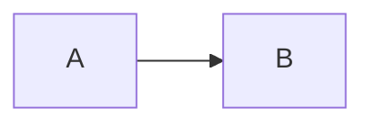
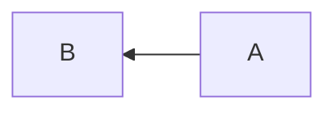
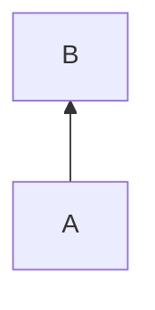
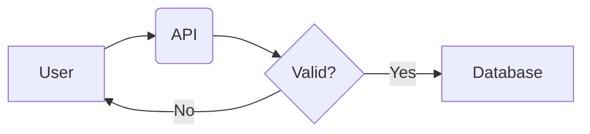
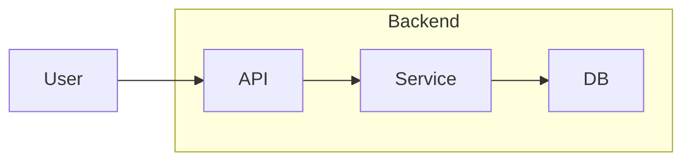
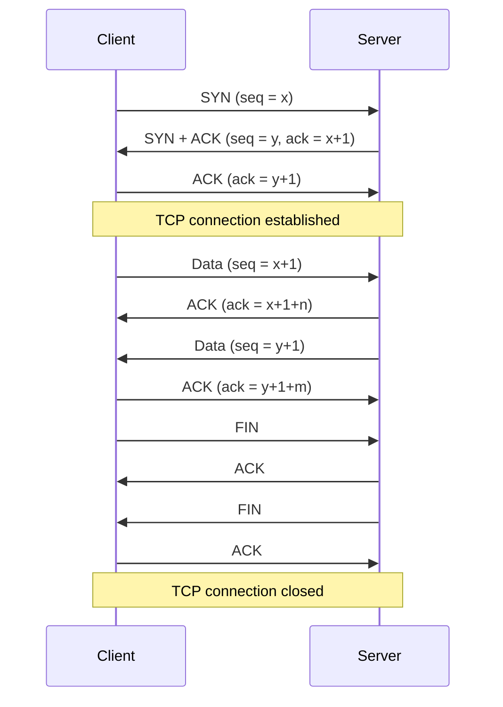
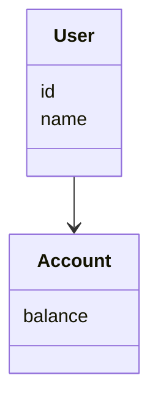
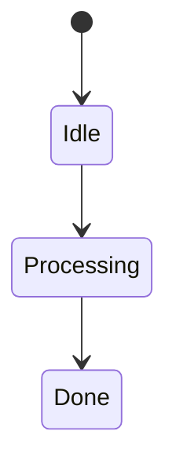
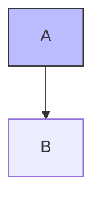

## What's mermaid

**Mermaid is a declarative language for creating diagrams using plaintext.**

Instead of drawing diagrams manually (as in draw.io), you **describe structures and relationships** in text, and Mermaid automatically generates the diagram when having a valid renderer on your computer (which is very likely, It's just an app written with javascript).
This makes it ideal for:

- Markdown
- Obsidian
- Versioning with Git
- Reading and reasoning by humans and by AI's ([[MCP]], [[LLMs]])
---
## Why using Mermaid on Obsidian?

- Is **plaintext** not something already rendered.
- Lives inside the `.md` file instead of being an image physically stored in assets
- Because isn't an image we can modify it when logic changes without needing to re-generate the image again after modifying the diagram in other external app such as draw.io

---

## How to use mermaid in a markdown note

First things first, you need to create a block of mermaid code because all mermaid diagrams are defined within a block of code.




 > \```mermaid (Activates the render) 
 > 	block of code
 > \```  

 > The rest of the characters inside the block defined by  those \``` ``` are still plaintext

---

## Tipo 1 — Flowchart

most common type (approximately 80% of all generated mermaid code are flowcharts)

### Minimum syntax


- `flowchart` → diagram type
- `TD` → direction (Top → Down)
- `A`, `B` → node
- `-->` → relation

### Possible orientations

- `TD` → top-down
- `LR` → left-right
- `RL` → right-left
- `BT` → bottom-top

1. TD

2. LF

3. RL

4. BT

---

### Nodes with text and forms
Just to remember, what is the orientation of this diagram? You can see the answer to this question just by seeing the code below.



look that you can declare the content and forms of each node before establishing the relations between every one of them.
common forms:
- `[Text]` → rectangle
- `(Text)` → rounded rectangle
- `{Text}` → decision
- `((Text))` → circle

---

## Sub graphs (Like boxes)



Useful for:
- group components
- represent layers
Note:
- The `end` statement is only used with subgraphs.
---

## Type 2 — Sequence Diagram (temporal sequences)

Ideal para:
- API
- Client/server flows
- MCP
- Call between services



Here:
- The **order** matters
- represent **time** not structure
---

## Tipo 3 — Class Diagram 

Useful for:
- software design
- conceptual models
- relations between entities



---

## Tipo 4 — State Diagram

Useful for
- flows
- business logic
- UI states



---

## Style (Just the minimum)


- With this you can change the background of a given node.

---

## Mermaid vs draw.io

### draw.io
- Ideal for sketches
- Charts focused on design

### Mermaid
- Ideal for MCP because It's just plain test
- Ideal for constant updates without needing to download the image over and over again with every modification on the graph
- Don't need to save anything as assets because code lives inside the `.md` file

---

## Limitations of Mermaid

- Mermaid **isn't designed** for artistic diagrams
- UI wireframes (Like sketches for web and desktop apps before getting into details)
- Manual alignment (because mermaid uses geometric managers)

Mermaid is for implement reasoning diagrams, if a diagram can't be represented on mermaid probably isn't a reasoning diagram.

---

Nice combination :
- Mermaid → diagram where the content lives
- draw.io → visual help
- Markdown → container
- MCP / LLM → reasoning

---
## Conclusion

Mermaid does not replace draw.io visually,  
but it **replaces what matters**:

- structure
- logic
- reasoning
- durability

For a long-term knowledge system, **Mermaid is the right choice**.

