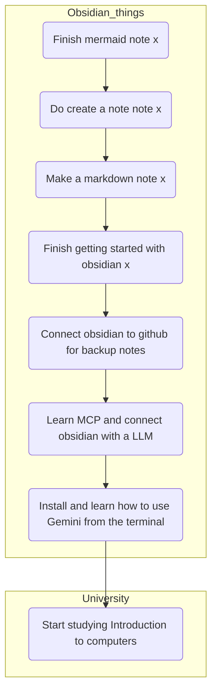

```mermaid
flowchart TD
Mermaid(Finish mermaid note x)
note1(Do create a note note x)
Markdown(Make a markdown note x)
intro_ob(Finish getting started with obsidian x)
ob_to_github(Connect obsidian to github for backup notes)
MCP(Learn MCP and connect obsidian with a LLM)
Gemini(Install and learn how to use Gemini from the terminal)
IC(Start studying Introduction to computers)
subgraph Obsidian_things
	Mermaid --> note1
	note1 --> Markdown
	Markdown --> intro_ob
	intro_ob --> ob_to_github
	ob_to_github --> MCP
	MCP --> Gemini
end
subgraph University
	Gemini --> IC
end
```
