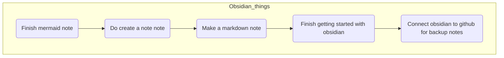

```mermaid
flowchart TD
Mermaid(Finish mermaid note)
note1(Do create a note note)
Markdown(Make a markdown note)
intro_ob(Finish getting started with obsidian)
ob_to_github(Connect obsidian to github for backup notes)
subgraph Obsidian_things
	Mermaid --> note1
	note1 --> Markdown
	Markdown --> intro_ob
	intro_ob --> ob_to_github
end
```
