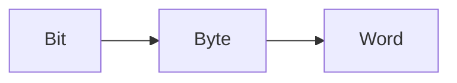
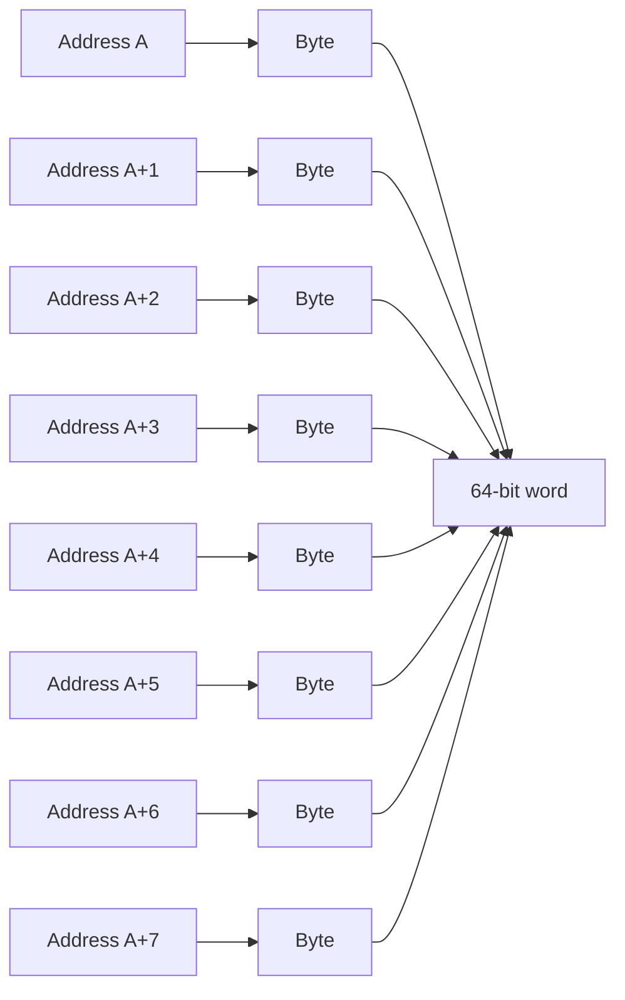
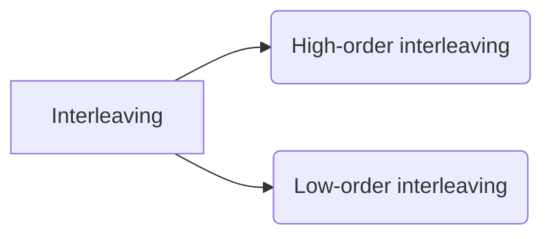

## How memory is actually organized

Memory can be seen as a **table**:
- Each **row** is a memory location
- Each location has:
    - an **address**
    - a **content** (a fixed number of bits)

`Address → Content`

Example:
`address`  `content`
`0000   → 01100100` 
`0001   → 10110101` 
`0010   → 11100100`

### Key idea:

>**Most modern computers are byte-addressable**, meaning that each memory address identifies a single 8-bit byte.
>
>**The physical storage per address are independent of the CPU architecture** (although byte addressing is the standard).
>
>**The CPU architecture defines the maximum number of addressable units**, but it does not impose a minimum; systems may implement fewer addressable units depending on the amount of installed memory.

---
## Memory Addressing Basics

### Byte-addressable systems (most modern computers)

- Each memory address identifies **1 byte (8 bits)**.
- The total number of memory addresses equals the total number of bytes.

If the system has:

- Total memory: M bytes

Then:

Number of addresses = M ~~bytes~~ (Total bytes) / 1 ~~bytes~~ (Bytes per address, content) = M
Bits to represent those addresses = log2(M)

### Key insight

 >Increasing the **addressable unit size (content)** reduces the **number of addresses**
>
  >Using twice the bytes per address (content) halves the number of addresses

---
## What a _word_ really is (intuitive definition)

 - **A word is the amount of data the CPU naturally handles in one basic operation.** You can think of it as the bites the CPU can take.

“Natural” means:
- one fetch
- one load
- one store
- one arithmetic or logic operation

#### Word size depends on the CPU architecture

| Architecture | Word size         |
| ------------ | ----------------- |
| 16-bit CPU   | 16 bits (2 bytes) |
| 32-bit CPU   | 32 bits (4 bytes) |
| 64-bit CPU   | 64 bits (8 bytes) |

- In a **32-bit system**, one word = **32 bits**.

Common doubt:
- Does “1 byte per memory address (1 byte content)” mean an 8-bit CPU?
	**No. Absolutely not.**
	If a memory system has **1 byte (8 bits) per address**, that only tells you **how memory is addressed**, **not** the CPU word size. As said before: 
		`The physical storage per address are independent of the CPU architecture`. So this means that a word and the address content aren't correlated in any way. A word is correlated with the maximum amount of directions a memory can have in order to be compatible with the given processor but not with the size(content) of each direction.
	
### Key insight

>The size of a word is **not universal**. It depends on the CPU architecture 

---
## Bit vs Byte vs Word (very important)

| Unit | Meaning                             |     |
| ---- | ----------------------------------- | --- |
| Bit  | 0 or 1                              |     |
| Byte | 8 bits                              |     |
| Word | **n bits (architecture-dependent)** |     |
### Key insight

> Bit is the more basic unit in the computer, then a Byte is just eight bits and a Word usually is greater than a byte but it could be less than one for really old Pc's with CPU's with less than 8 bits architecture, but the usual are CPU's with 32-64 bits so the common size of a word is 32-64 bits.

---
## Example: a 64-bit CPU with byte-addressable memory

This is the **most common case today**.
### CPU

- Word size: **64 bits** so we have:
	- Registers: 64 bits
	- ALU: operates on 64 bits
### Memory

- Addressable unit: **1 byte**
- To read a 64-bit word → CPU reads **8 consecutive bytes**

## Adding Bytes to Memory Addresses (Byte-Addressed Systems)

### Key idea

In a **byte-addressed system**, **each memory address refers to exactly one byte**.  
Therefore, memory addresses always count **bytes**, not bits and not hexadecimal digits.
### What “adding bytes” means

When a data item occupies **N bytes**, it uses **N consecutive memory addresses**.
- The next data item starts at:
	`current_address + N`
This addition is done **numerically**, not by counting hexadecimal digits.
### Hexadecimal clarification

- 1 hexadecimal digit = 4 bits
- 1 byte = 8 bits = **2 hexadecimal digits**
This relationship helps to _read_ addresses, but:

> **You do NOT add hexadecimal digits — you add byte values**
>
>In a byte-addressed system, adding the size of a data object moves the address to the first byte of the next object. If they ask for a direction that starts at 0XAB010000 with a vector: **vectorX: .double 0.5, 0.2, 0.8, 1.2** Then the first byte of 0.5 is pointed for 0XAB010000 so we must add 7 bytes more to reach the last byte of the first number(because It's .double and that is 64 bits -> 8bytes). But that isn't the convention, the convention is not finishing at the end of the same data object but at the start of the next, so we must add 8 and we moves the address to the first byte of the next object, in this case 0.2. If we add 8 we get the first byte of 0.8 and if we add 8 again we get to the first byte of 1.2. The first byte is what It's needed to represent an object in memory so the answer to this problem would be 0XAB0100018.

## 1. What are _memory modules_?

A **memory module** is a **physical subdivision of main memory**.
Instead of building one large, monolithic memory:
- Memory is split into **several smaller independent blocks**
- Each block is called a **module**
- All modules together form **the same logical memory space**

> From the CPU’s point of view, memory is still **one contiguous address space**.  
> Modules are a **hardware organization detail**, not a programming one.

Example:
- Total memory: **64 MiB**
- Number of modules: **8**
- Each module capacity:
$$
\frac{64\ \text{MiB}}{8} = 8\ \text{MiB per module}
$$

# Memory Interleaving

## Core Idea
We have two interleaved main memory systems:

In an interleaved main memory system, the physical address space is distributed across several independent memory modules.

To do this, **a subset of bits of the physical address is used to identify the memory module** where a given address is stored.

---
## Number of Bits Used to Identify the Module

Let:

- **M** = number of memory modules
- **X** = number of bits needed to identify a module

Then:
$$X = log_2(M)$$
### Key property

> **The number of bits reserved to select the module is fixed for a given system configuration.**

This depends **only** on the number of modules and **does not depend** on the interleaving scheme used.

Example:
$$M=8⇒x=log_2(8) = 3 bits$$

These **same 3 bits** are always used to encode the module number.

---

## What Changes Between Interleaving Schemes

Although the **number of bits** used to select the module remains constant, **their position inside the address changes** depending on the interleaving scheme.

This is the **only difference** between:

- **High-order interleaving**
- **Low-order interleaving**

---
## High-Order Interleaving
### Definition
- The **most significant bits** of the address select the module.
- Each module stores a **contiguous block** of the address space.
### Address format

`[ module bits (x MSBs) | offset within module ]`

---
## Low-Order Interleaving 
### Definition
- The **least significant bits** of the address select the module.
- Consecutive addresses are distributed across different modules.
### Address format
`[ offset within module | module bits (x LSBs) ]`

---

## Final Summary (Key Insight)

> - The **number of module-selection bits** is determined solely by the number of modules:
>     $$x = \log_2(M)$$
> - This number is **the same** for both high-order and low-order interleaving.
> - What changes is **which bits of the address are used**:
>     - **High-order interleaving** → most significant bits
>     - **Low-order interleaving** → least significant bits

## When to use one over the other?

Low-order interleaving maximizes parallelism for sequential access, but high-order interleaving can be preferable when tasks operate on disjoint memory regions, when fault isolation is important, or when system scalability and simplicity are priorities. Low-order is the most used by far between this two, precisely to maximize parallelism for sequential access which is by far more common.