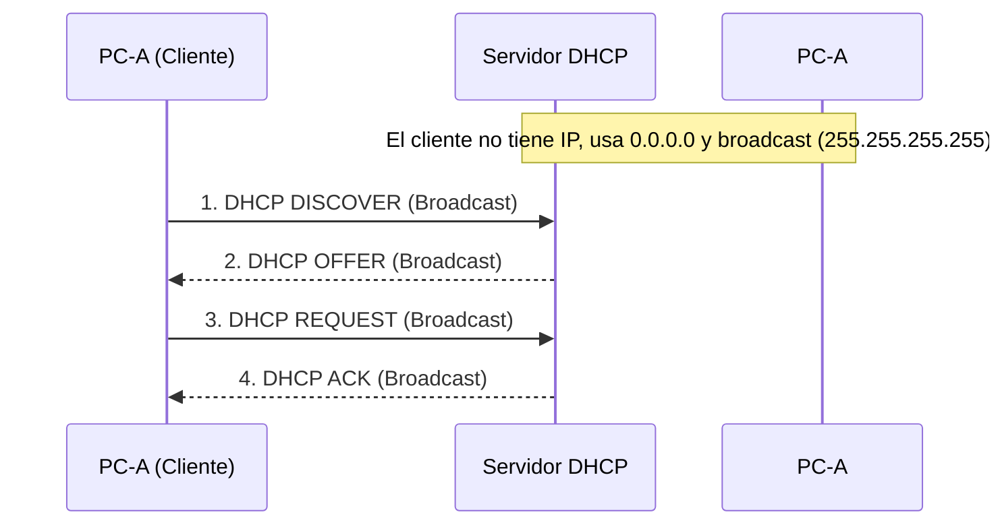
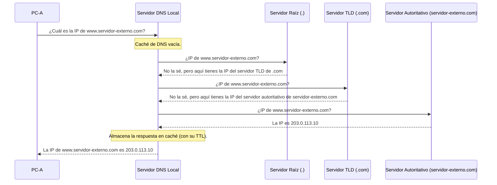
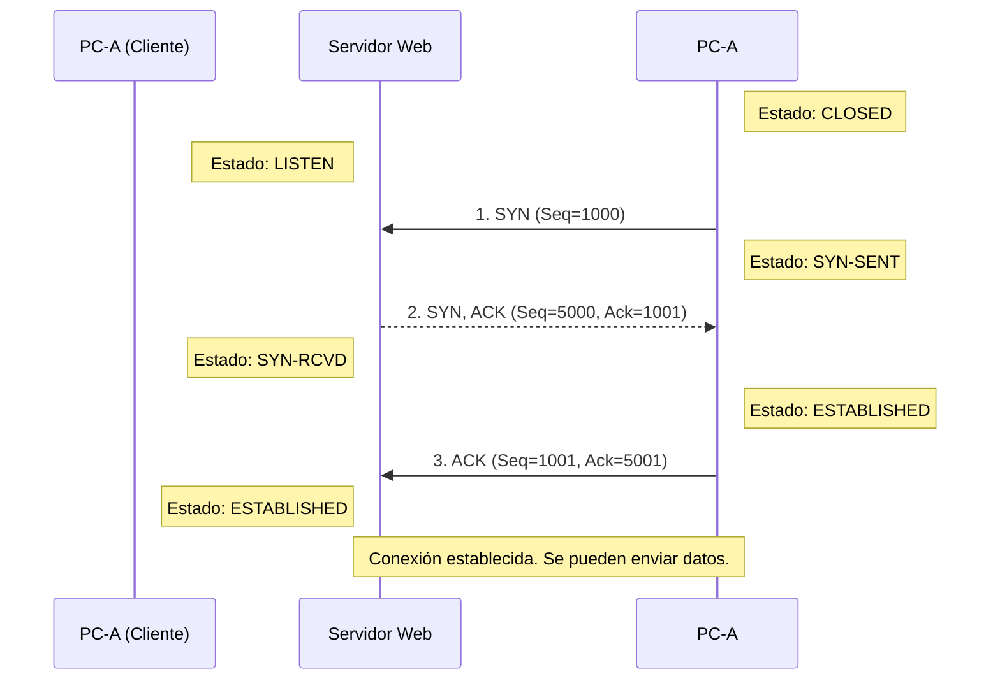
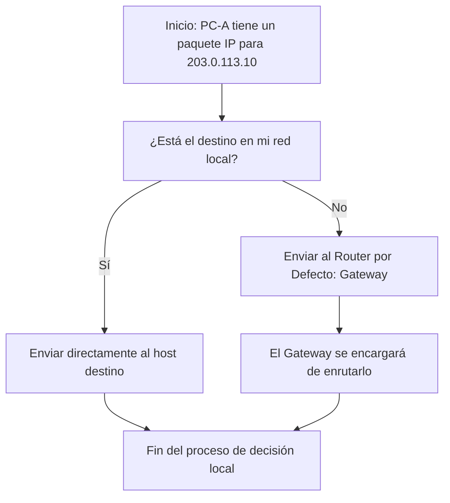
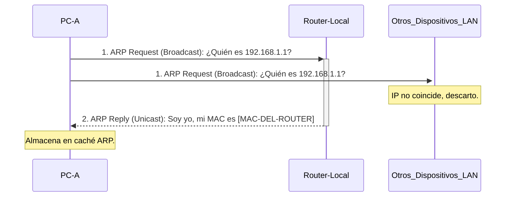
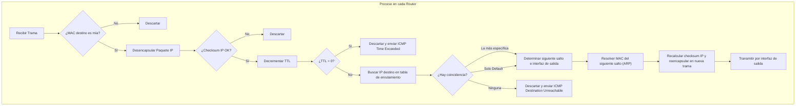

# La Gran Comunicación: Un Pipeline de Red Completo

## Introducción

Este documento tiene como objetivo desglosar y explicar el proceso completo de comunicación a través de una red de computadoras, desde el momento en que un usuario inicia una acción hasta que se recibe una confirmación. Se trata de un recorrido exhaustivo a través de las capas del modelo TCP/IP, integrando todos los conceptos teóricos clave presentados en la asignatura de Redes.

El enfoque principal es explicar el pipeline "desde cero", asumiendo un estado inicial donde no hay información pre-configurada o caches almacenadas. Esto nos obligará a explorar los protocolos y mecanismos que permiten a los dispositivos de red descubrirse, enrutarse y comunicarse por primera vez. Se abordarán tanto las comunicaciones orientadas a conexión (TCP) como las no orientadas a conexión (UDP), así como los casos límite y escenarios alternativos.

El objetivo es que este documento sirva como una guía de referencia unificada, capaz de responder a cualquier pregunta sobre el funcionamiento interconectado de los protocolos de red.

## Escenario Principal: "Desde Cero"

Para guiar nuestra explicación, nos basaremos en el siguiente escenario:

Un usuario en su `PC-A` quiere descargar un archivo alojado en un servidor web `www.servidor-externo.com`.

### Actores y Entorno

*   **PC-A (Cliente):**
    *   Dirección IP: Desconocida.
    *   Máscara de subred: Desconocida.
    *   Router por defecto: Desconocido.
    *   Servidor DNS: Desconocido.
    *   Caché ARP: Vacía.
    *   Se encuentra en una red local `LAN A`.

*   **Router-Local (Gateway):**
    *   Conecta `LAN A` con el resto de Internet.
    *   Tabla de enrutamiento: Inicialmente vacía, solo conoce las redes directamente conectadas.

*   **Servidor Web (Servidor):**
    *   Dominio: `www.servidor-externo.com`.
    *   Aloja el archivo que `PC-A` desea descargar.
    *   Se encuentra en una red remota.

### El Desencadenante

El usuario en `PC-A` abre un navegador web y escribe `http://www.servidor-externo.com/archivo.zip` y presiona Enter.

A partir de este momento, se inicia una compleja secuencia de eventos que analizaremos capa por capa, desde la capa de Aplicación hasta la capa Física.

## El Pipeline de Comunicación

### Fase 1: Configuración Inicial del Host (PC-A)

Antes de que `PC-A` pueda siquiera pensar en contactar al servidor web, necesita su propia configuración de red.

#### 1.1. Descubrimiento de Configuración: DHCP

`PC-A` arranca y no tiene una dirección IP. Para obtener una, utiliza el protocolo **DHCP (Dynamic Host Configuration Protocol)**, que opera sobre UDP. Como el cliente no tiene IP, todos los mensajes iniciales se envían a la dirección de broadcast `255.255.255.255`.

El proceso, conocido como DORA, consta de 4 pasos:

1.  **DHCP DISCOVER:** El `PC-A` (cliente) envía un mensaje de broadcast a toda su red local, buscando un servidor DHCP.
2.  **DHCP OFFER:** Uno o más servidores DHCP en la red responden al cliente con un mensaje de broadcast, ofreciéndole una configuración de red (IP, máscara, etc.).
3.  **DHCP REQUEST:** El cliente elige una de las ofertas y envía un mensaje de broadcast(este mensaje es fundamental tambien para el resto de servidores DHCP que tras recibir este mensaje descartan la IP si la tenian registrada como libre ya que un dispositivo la ha solicitado formalmente) a la red, solicitando formalmente la configuración ofrecida e identificando al servidor elegido.
4.  **DHCP ACK (Acknowledgement):** El servidor DHCP elegido confirma la asignación y la registra. Envía un último mensaje de broadcast al cliente con la información completa y el tiempo de validez de la asignación.



**Caso Límite: ¿Y si no hay servidor DHCP?**
Si `PC-A` no recibe respuesta, puede auto-asignarse una dirección IP del rango **APIPA (Automatic Private IP Addressing)**, que es `169.254.0.0/16`. Para evitar conflictos, antes de usar una IP de este rango, el PC realizaría una petición ARP para comprobar que no está en uso. Esto le permitiría comunicarse con otros dispositivos en la misma situación dentro de su LAN, pero no tener acceso a internet.

Al final de este proceso, `PC-A` ha obtenido:
*   Una **Dirección IP** (ej. `192.168.1.100`).
*   Una **Máscara de Subred** (ej. `255.255.255.0`).
*   La dirección IP de su **Router por defecto** (Gateway, ej. `192.168.1.1`).
*   La dirección IP de un **Servidor DNS** (ej. `192.168.1.1` si el router hace de forwarder, u `8.8.8.8` si es uno externo).

### Fase 2: Capa de Aplicación - La Intención del Usuario

Todo comienza con la solicitud del usuario.

#### 2.1. Resolución de Nombres: DNS

El navegador no puede conectarse a `www.servidor-externo.com` directamente; necesita su dirección IP. Aquí entra en juego el **DNS (Domain Name System)**. El cliente DNS del sistema operativo (resolver) crea una consulta DNS para un registro de tipo 'A' (dirección IPv4) y la envía al servidor DNS que obtuvo por DHCP.

El proceso de resolución puede ser:

*   **Recursivo:** El servidor DNS local se encarga de hacer todo el trabajo.
*   **Iterativo:** El servidor DNS local va preguntando a otros servidores y la responsabilidad se va delegando.

Normalmente, la consulta del cliente al servidor local es recursiva, y las consultas entre servidores DNS son iterativas.



El resultado es que `PC-A` ahora sabe que `www.servidor-externo.com` corresponde a la dirección IP `203.0.113.10`.

#### 2.2. Inicio de la Comunicación: HTTP

Con la IP del destino en mano, el navegador se prepara para solicitar el archivo `archivo.zip`. Para ello, construye una petición HTTP. Siguiendo el estándar HTTP/1.1 (el más común), la petición tendría una estructura similar a esta:

```
GET /archivo.zip HTTP/1.1
Host: www.servidor-externo.com
Connection: close
User-Agent: Mozilla/5.0
Accept-Language: es
```

*   **GET:** Es el método de petición, indica que queremos obtener un recurso.
*   **Host:** Especifica el dominio al que nos dirigimos. Es obligatorio en HTTP/1.1.
*   **Connection: close:** Indica que cerraremos la conexión después de esta petición (no persistente).

El navegador le pasa esta petición, que son datos de aplicación, a la siguiente capa: la capa de Transporte.

### Fase 3: Capa de Transporte - Estableciendo un Canal Fiable

Para una descarga de archivo, se necesita una comunicación fiable que asegure que todos los datos llegan correctamente y en orden. El sistema operativo elige **TCP (Transmission Control Protocol)**.

Antes de poder enviar datos, TCP debe establecer una conexión. Esto se realiza mediante un proceso conocido como **Three-Way Handshake (saludo a tres vías)**. El objetivo es que ambos extremos (cliente y servidor) sincronicen sus números de secuencia iniciales (ISN) y confirmen que están listos para comunicarse.

1.  **SYN (Synchronize):** El cliente (`PC-A`) inicia la conexión. Para ello, elige un puerto de origen efímero (ej. 49152) y envía un segmento TCP al servidor (`203.0.113.10`) al puerto destino conocido para HTTP, el puerto 80.
    *   Este primer segmento tiene el flag `SYN` activado.
    *   Contiene el Número de Secuencia Inicial del cliente (ISN_Cliente), un valor pseudo-aleatorio (ej. `Seq=1000`).

2.  **SYN-ACK (Synchronize-Acknowledge):** El servidor, que estaba esperando conexiones en su puerto 80 (apertura pasiva), recibe el segmento SYN. Responde con un segundo segmento que tiene dos propósitos:
    *   Confirmar la recepción del SYN del cliente. Para ello, activa el flag `ACK` y establece el número de acuse de recibo en `ISN_Cliente + 1` (ej. `Ack=1001`).
    *   Iniciar la conexión en la dirección opuesta. Para ello, activa también el flag `SYN` y elige su propio Número de Secuencia Inicial (ISN_Servidor), que también es pseudo-aleatorio (ej. `Seq=5000`).

3.  **ACK (Acknowledge):** El cliente recibe el segmento SYN-ACK. La conexión ya está establecida por su parte. Para completar el proceso, envía un tercer y último segmento:
    *   Este segmento tiene el flag `ACK` activado.
    *   Confirma la recepción del SYN del servidor, estableciendo el número de acuse de recibo en `ISN_Servidor + 1` (ej. `Ack=5001`).
    *   Este segmento ya puede contener los primeros datos de la capa de aplicación (la petición HTTP).



Una vez la conexión está en estado `ESTABLISHED` en ambos extremos, la capa de transporte del cliente puede tomar los datos de la capa de aplicación (la petición HTTP) y enviarlos dentro de uno o más segmentos TCP al servidor.

### Fase 4: Capa de Red - El Plan de Viaje

Cada segmento TCP es encapsulado en un **paquete IP** (o datagrama). La capa de Red añade su propia cabecera con información crucial para el viaje a través de Internet.

Los campos más relevantes de la cabecera IP para este primer paso son:
*   **IP Origen:** `192.168.1.100` (La IP de `PC-A`).
*   **IP Destino:** `203.0.113.10` (La IP de `www.servidor-externo.com` que obtuvimos vía DNS).
*   **Protocolo:** `6 (TCP)`, para que el receptor sepa a qué protocolo de capa de transporte entregar el segmento.
*   **TTL (Time To Live):** Un valor inicial (ej. 64) que se decrementará en cada router para evitar bucles infinitos.

Con el paquete IP construido, el sistema operativo de `PC-A` debe tomar una decisión fundamental: **¿cómo envío este paquete?** La respuesta depende de si el destino está en la misma red local o no.

Para determinarlo, `PC-A` realiza una operación lógica `AND` entre su propia IP y su máscara de subred, y la compara con el resultado de hacer la misma operación entre la IP de destino y su propia máscara de subred.

*   **Red Local:** `192.168.1.100` AND `255.255.255.0` = `192.168.1.0`
*   **Red Destino (cálculo desde PC-A):** `203.0.113.10` AND `255.255.255.0` = `203.0.113.0`

Como `192.168.1.0` es diferente de `203.0.113.0`, el `PC-A` concluye que el destino está en una **red remota**. Por lo tanto, no puede enviar el paquete directamente al destino. Debe enviárselo a su puerta de enlace, el **router por defecto** (`192.168.1.1`), confiando en que este sabrá cómo continuar el viaje.

Este proceso de decisión se puede visualizar así:



Ahora el problema se ha transformado: para enviar el paquete IP al gateway `192.168.1.1`, `PC-A` necesita conocer su dirección física. Esto nos lleva a la siguiente capa.

### Fase 5: Capa de Enlace - El Primer Salto

El `PC-A` sabe que debe enviar el paquete IP a su gateway (`192.168.1.1`), pero la comunicación en una red local como Ethernet no utiliza direcciones IP, sino direcciones físicas **MAC (Media Access Control)**.

Por lo tanto, `PC-A` necesita descubrir la dirección MAC del interfaz del router que tiene la IP `192.168.1.1`.

#### 5.1. Resolución de Direcciones Físicas: ARP

Aquí entra en juego el **ARP (Address Resolution Protocol)**. Su función es traducir una dirección de capa de red (IP) a una dirección de capa de enlace (MAC) dentro de una misma red local.

El proceso es el siguiente:

1.  **Consultar la Caché ARP:** `PC-A` primero mira en su tabla ARP local si ya conoce la MAC asociada a `192.168.1.1`. En nuestro escenario "desde cero", esta **caché está vacía**.

2.  **Enviar un ARP Request:** Al no encontrar una entrada, `PC-A` debe preguntar. Para ello, construye un mensaje **ARP Request** y lo envía a la red. Este mensaje es un **broadcast** de capa de enlace (dirección MAC de destino `FF:FF:FF:FF:FF:FF`), lo que significa que llegará a todos los dispositivos de la `LAN A`. El mensaje pregunta: *"¿Quién tiene la dirección IP 192.168.1.1?"*.

3.  **Recibir un ARP Reply:** Todos los dispositivos en la LAN reciben y procesan la petición ARP.
    *   Los dispositivos cuya IP no sea `192.168.1.1` simplemente descartan el paquete.
    *   El `Router-Local`, al reconocer su propia IP, responde con un mensaje **ARP Reply**. Esta respuesta es **unicast**, dirigida directamente a la dirección MAC de `PC-A` (que venía dentro del ARP Request). El mensaje dice: *"Yo tengo la IP 192.168.1.1, y mi MAC es [MAC-DEL-ROUTER]"*.

4.  **Actualizar la Caché y Enviar:** `PC-A` recibe el ARP Reply, y ahora sí conoce la MAC del gateway. Lo primero que hace es **almacenar este mapeo (`192.168.1.1` -> `[MAC-DEL-ROUTER]`) en su caché ARP** para no tener que preguntar la próxima vez. Con esta información, finalmente puede construir la trama Ethernet.



#### 5.2. Encapsulación de la Trama Ethernet

Ahora `PC-A` tiene toda la información para enviar su paquete IP. La capa de enlace lo encapsula en una **trama Ethernet**:

*   **MAC Destino:** La MAC del `Router-Local`.
*   **MAC Origen:** La MAC de `PC-A`.
*   **Tipo (EtherType):** `0x0800` para indicar que el contenido (payload) es un paquete IPv4.
*   **Datos:** El paquete IP completo (cabecera IP + segmento TCP).
*   **FCS (Frame Check Sequence):** Una suma de comprobación para que el receptor pueda verificar si la trama se ha dañado durante la transmisión.

#### 5.3. Capa Física
Finalmente, esta trama se convierte en una secuencia de bits que se transmiten a través del medio físico (un cable Ethernet, ondas de radio si es Wi-Fi) hacia el router.

### Fase 6: El Viaje a Través de Internet

La trama Ethernet llega al `Router-Local` a través de su interfaz conectada a la `LAN A`. El trabajo del router es fundamental para que el paquete continúe su camino hacia redes remotas.

#### 6.1. Procesamiento en el Router

El router realiza los siguientes pasos:

1.  **Recepción (Capas 1 y 2):** Recibe las señales eléctricas (Capa 1), reconstruye la trama Ethernet (Capa 2), comprueba el FCS para asegurarse de que no hay errores, y verifica que la MAC de destino es la suya.
2.  **Desencapsulación (Capa 3):** Al confirmar que la trama es para él, extrae el paquete IP que contiene.
3.  **Análisis de la Cabecera IP:** El router inspecciona la cabecera del paquete IP:
    *   Verifica el checksum de la cabecera para asegurar su integridad.
    *   Decrementa el campo **TTL** en 1 (ej. de 64 a 63). Si el TTL llegara a 0, el router descartaría el paquete y enviaría un mensaje ICMP "Tiempo excedido" al origen para evitar bucles de enrutamiento.
    *   Lo más importante: examina la **IP de destino**: `203.0.113.10`.

#### 6.2. Decisión de Enrutamiento: La Tabla de Enrutamiento

El router debe decidir por cuál de sus interfaces enviará el paquete. Para ello, consulta su **tabla de enrutamiento**.

**Caso Límite: Tabla de Enrutamiento "Vacía"**

En nuestro escenario, el router acaba de arrancar. Su tabla no está literalmente vacía; contiene como mínimo las **redes directamente conectadas**. Por ejemplo:

| Destino         | Gateway       | Máscara           | Flags | Interfaz |
|-----------------|---------------|-------------------|-------|----------|
| `192.168.1.0`   | `0.0.0.0`     | `255.255.255.0`   | U     | `eth0`   |
| `ISP_NET_IP`    | `0.0.0.0`     | `ISP_NET_MASK`    | U     | `eth1`   |
| `0.0.0.0`       | `ISP_ROUTER_IP` | `0.0.0.0`         | UG    | `eth1`   |

El router aplica el algoritmo de **longest match prefix**: busca la entrada en la tabla que coincida con la IP de destino (`203.0.113.10`) usando la máscara más específica (con más bits a 1).

1.  Compara con `192.168.1.0/24`. No coincide.
2.  Compara con `ISP_NET_IP/MASK`. Asumamos que no coincide.
3.  **Coincidencia con la Ruta por Defecto:** Cualquier dirección IP coincide con la ruta `0.0.0.0/0`. Esta es la **ruta por defecto** o "gateway de último recurso". Esta entrada le dice al router: "Si no sabes a dónde va un paquete, envíalo a `ISP_ROUTER_IP` a través de la interfaz `eth1`". Esta ruta es fundamental para la conectividad a Internet y se configura estáticamente o se aprende del ISP (normalmente vía DHCP o un protocolo de enrutamiento).

#### 6.3. El Ciclo se Repite: Re-encapsulación y Envío

El router ya sabe qué hacer: enviar el paquete a `ISP_ROUTER_IP`. Ahora, el router actúa como un host:

1.  Necesita la dirección MAC de `ISP_ROUTER_IP`. Lanza una petición **ARP** a través de su interfaz `eth1`.
2.  Una vez obtiene la MAC, vuelve a encapsular el paquete IP (que ahora tiene un TTL menor) en una **NUEVA trama de capa de enlace**, apropiada para el medio entre el `Router-Local` y el router del ISP.
    *   **MAC Destino:** La MAC del router del ISP.
    *   **MAC Origen:** La MAC de la interfaz `eth1` del `Router-Local`.
3.  Transmite la nueva trama.

**Este ciclo de desencapsular, consultar tabla, decrementar TTL y re-encapsular se repite en cada router (salto) a lo largo de todo el camino hasta que el paquete llega a un router que está directamente conectado a la red de destino.**



### Fase 7: Llegada y Confirmación

Después de viajar a través de múltiples routers, el paquete IP finalmente llega al router de la red donde se aloja el `Servidor Web`. Este último router, al consultar su tabla, encuentra una coincidencia para una red directamente conectada (`203.0.113.0/24`). Realiza un ARP para encontrar la MAC del servidor (`203.0.113.10`) y le entrega la trama final.

#### 7.1. Procesamiento Inverso en el Servidor

El servidor recibe la trama y comienza el proceso de desencapsulación, subiendo por el stack TCP/IP:

1.  **Capa de Enlace:** Confirma que la MAC destino es la suya, comprueba el FCS y extrae el paquete IP.
2.  **Capa de Red:** Confirma que la IP destino es la suya, comprueba el checksum de la cabecera y mira el campo "Protocolo" (que es 6, para TCP). Pasa el contenido (el segmento TCP) a la capa de Transporte.
3.  **Capa de Transporte:** El sistema operativo del servidor ve que el segmento va dirigido al puerto 80. Como el servidor web está escuchando (`LISTEN`) en ese puerto para la conexión ya establecida (`ESTABLISHED`), acepta el segmento.
4.  **Capa de Aplicación:** El servidor web recibe los datos del segmento TCP, que no es más que la petición `GET /archivo.zip ...`.

#### 7.2. La Respuesta: Transferencia de Datos y Fiabilidad TCP

El servidor web procesa la petición: localiza el fichero `archivo.zip` y se prepara para enviarlo.

1.  **Segmentación:** El archivo se divide en trozos. Cada trozo se convierte en el payload de un nuevo segmento TCP. Las direcciones y puertos ahora se invierten: IP Origen (`203.0.113.10`), Puerto Origen (80), IP Destino (`192.168.1.100`), Puerto Destino (49152).
2.  **Control de Flujo (Ventana Deslizante):** El servidor no puede enviar datos a lo loco. El `PC-A` (cliente) le ha anunciado un **tamaño de ventana de recepción** durante el handshake. El servidor no puede tener más bytes "en vuelo" (enviados pero no confirmados) que el tamaño de esa ventana. Esto evita que el servidor sature al cliente.
3.  **Confirmaciones (ACKs):** A medida que los segmentos de datos llegan al `PC-A`, la capa TCP del cliente envía segmentos de **ACK (acuse de recibo)** de vuelta.
    *   Estos ACKs son **acumulativos**: si el servidor recibe un ACK con `Ack=7000`, significa que el cliente ha recibido correctamente todos los bytes hasta el 6999.
    *   El `PC-A`, al enviar ACKs, también puede actualizar el tamaño de su ventana de recepción, permitiendo al servidor enviar más datos.
4.  **Control de Errores y Congestión:** Si un segmento se pierde, el servidor se entera porque:
    *   **Vence el Temporizador (RTO):** No recibe un ACK para ese segmento en un tiempo prudencial. Vuelve a enviar el segmento perdido.
    *   **Recibe ACKs Duplicados:** Si el cliente recibe segmentos desordenados, sigue enviando ACKs para el último byte que recibió en orden. Si el servidor recibe tres de estos ACKs duplicados (**Fast Retransmit**), asume que el segmento siguiente se ha perdido y lo reenvía sin esperar a que venza el temporizador.
    *   En ambos casos, el servidor también reduce su velocidad de envío (**Control de Congestión**) para no saturar la red.

#### 7.3. Cierre de la Conexión

Una vez que el servidor ha enviado todo el archivo, y el cliente ha confirmado la recepción de todo, la conexión se cierra. Esto se hace con un **saludo de cuatro vías**:

1.  **FIN:** El proceso que quiere cerrar (en este caso, el servidor, ya que la petición era `Connection: close`) envía un segmento con el flag `FIN` activado.
2.  **ACK:** El cliente recibe el FIN y responde con un `ACK` para confirmarlo. En este punto, el cliente ya no espera más datos del servidor.
3.  **FIN:** El cliente, por su parte, también envía un `FIN` para cerrar la conexión en su dirección.
4.  **ACK:** El servidor recibe el FIN del cliente y responde con su propio `ACK`. La conexión queda completamente cerrada.

## Variantes y Otros Escenarios

### Comunicación No Orientada a Conexión: UDP

Si la aplicación hubiera utilizado UDP (User Datagram Protocol) en lugar de TCP (por ejemplo, para una consulta DNS, un videojuego o streaming), el pipeline sería notablemente más simple:

*   **Sin Handshake:** No hay un saludo de tres vías. La capa de transporte simplemente toma los datos, les añade una cabecera UDP (con puertos y checksum) y los pasa a la capa de red.
*   **Sin Garantía de Entrega:** UDP no espera confirmaciones (ACKs), no tiene temporizadores de retransmisión ni control de flujo. Los paquetes se envían y se "espera" que lleguen, pero no hay mecanismo para recuperarlos si se pierden.
*   **Pipeline Acelerado:** Todo el proceso de las fases 3 (Transporte) y 7 (Confirmación) se reduce drásticamente. El primer paquete ya contiene datos de aplicación y no hay un flujo de ACKs de vuelta.

### Comunicación en la Misma Red Local

Consideremos un escenario donde `PC-A` (`192.168.1.100`) quiere acceder a un servidor de archivos en `PC-B` (`192.168.1.150`) dentro de la misma `LAN A`.

El pipeline cambia fundamentalmente en la **Fase 4 (Capa de Red)**:

1.  `PC-A` realiza el mismo cálculo de enrutamiento:
    *   Red Local: `192.168.1.100` AND `255.255.255.0` = `192.168.1.0`
    *   Red Destino: `192.168.1.150` AND `255.255.255.0` = `192.168.1.0`
2.  Como ambas redes coinciden, `PC-A` determina que el destino está en su **misma red local**.
3.  **No se usa el Gateway:** El paquete no se envía al router por defecto.
4.  El proceso salta directamente a la **Fase 5 (Capa de Enlace)**, pero con una diferencia: `PC-A` hará una petición **ARP** no para el gateway, sino **directamente para la IP `192.168.1.150`**.
5.  `PC-B` responderá al ARP, `PC-A` creará una trama Ethernet con la MAC de `PC-B` como destino y se la enviará directamente a través del switch de la LAN. El viaje termina ahí, sin involucrar a ningún router.

### Modelos de Comunicación

*   **Cliente-Servidor:** Es el modelo que hemos seguido. Un cliente inicia peticiones a un servidor centralizado que responde.
*   **Peer-to-Peer (P2P):** En un modelo P2P, no hay servidores fijos. Cada participante (`peer`) actúa como cliente y servidor a la vez. En el contexto de nuestro pipeline, un `peer` que descarga un fichero estaría ejecutando múltiples pipelines de TCP simultáneamente, uno por cada `peer` al que está conectado para intercambiar partes del fichero. La localización de otros `peers` a menudo depende de un sistema centralizado (tracker) o descentralizado (DHT), añadiendo una capa de descubrimiento sobre el pipeline de comunicación básico.

### Abstracciones Modernas: Virtualización y Cloud

La totalidad de este pipeline puede existir en un entorno virtualizado, lo que añade capas de abstracción pero no altera los principios fundamentales:

*   **Virtualización de Plataforma:** Nuestro `PC-A` y el `Servidor Web` podrían ser **máquinas virtuales (VMs)** corriendo sobre un mismo hipervisor o en diferentes continentes. El hipervisor se encarga de presentarles una tarjeta de red virtual (vNIC).
*   **Virtualización de Red:** La `LAN A` podría no ser una red física, sino una **VLAN** o una **Red Virtual** en la nube (como una VPC en AWS). El "cable" que conecta `PC-A` con el `Router-Local` es en realidad una construcción lógica gestionada por el hipervisor o la infraestructura cloud.
*   **Componentes Virtualizados:** El `Router-Local` podría ser un router físico, o podría ser una VM especializada en enrutamiento, un "security group" en la nube, o una función de un hipervisor.
*   **IaaS, PaaS, SaaS:** En un modelo **IaaS (Infrastructure-as-a-Service)**, el usuario gestionaría las VMs y las redes virtuales, por lo que sería consciente de gran parte de este pipeline. En modelos **PaaS y SaaS**, la mayor parte de estas capas de red están completamente abstraídas para el usuario final, que simplemente interactúa con una aplicación sin preocuparse de IPs, puertos o enrutamiento.

Independientemente de la virtualización, para que la VM de `PC-A` se comunique con la VM del `Servidor Web`, los paquetes TCP/IP siguen siendo creados, las direcciones MAC siguen siendo resueltas (aunque sea entre componentes virtuales) y las decisiones de enrutamiento siguen siendo tomadas para mover los paquetes desde el origen hasta el destino.
