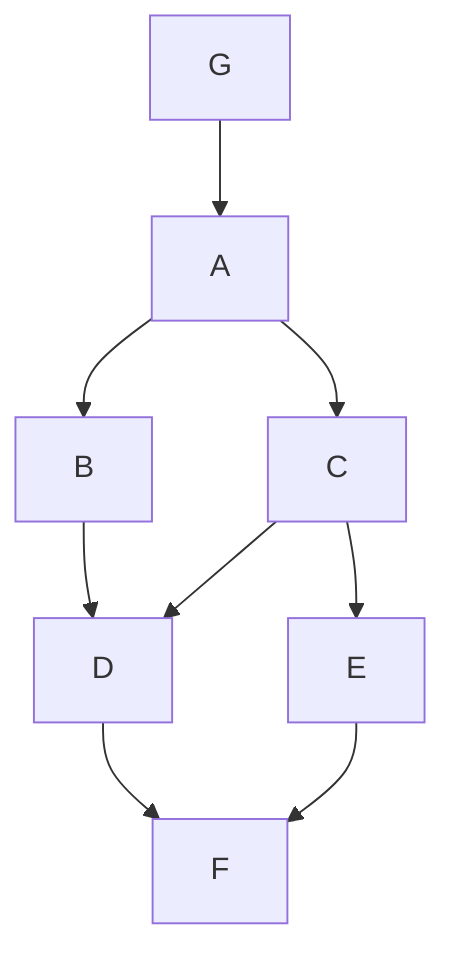

# Tema 6: Exploración de Grafos

La exploración o recorrido de grafos es un conjunto de algoritmos fundamentales para visitar y procesar todos los nodos de un grafo de manera sistemática. Estas técnicas son la base para resolver una gran cantidad de problemas más complejos.

## 1. Conceptos y Representaciones

Antes de explorar un grafo, debemos tener claro cómo se representa en memoria. Las dos formas más comunes son:

-   **Matriz de Adyacencia:** Una matriz `VxV` donde `M[i][j] = 1` (o el peso) si hay una arista de `i` a `j`. Ocupa `O(V²)` espacio, lo cual es ineficiente para grafos con pocas aristas (dispersos).
-   **Lista de Adyacencia:** Un array (o diccionario) donde por cada vértice `u`, se almacena una lista de sus vértices vecinos. Ocupa `O(V+E)` espacio, siendo la representación preferida para la mayoría de los casos.

Los algoritmos de recorrido asumen que el grafo se proporciona en una de estas representaciones. Su complejidad se expresa en términos de `V` (número de vértices) y `E` (número de aristas).

## 2. Recorrido en Anchura (BFS - Breadth-First Search)

El BFS explora el grafo "capa por capa" a partir de un nodo de origen. Primero visita todos los nodos a distancia 1, luego todos los nodos a distancia 2, y así sucesivamente.

-   **Principio de Funcionamiento:** Utiliza una **cola (Queue)** para gestionar los nodos pendientes de visitar, siguiendo una lógica FIFO (First-In, First-Out).
-   **Propiedades:**
    -   Encuentra el camino más corto en términos de número de aristas desde el origen a todos los demás nodos en grafos no ponderados.
    -   Es un algoritmo iterativo por naturaleza.
-   **Complejidad:** `O(V + E)`. Cada vértice y cada arista se visitan una sola vez.

### Pseudocódigo (BFS)
```
procedimiento BFS(Grafo, nodo_origen)
  crear una cola Q
  crear un conjunto 'visitados'

  añadir nodo_origen a Q y a 'visitados'

  mientras Q no esté vacía:
    u := Q.desencolar()
    // Procesar u (ej. imprimirlo)

    para cada vecino v de u:
      si v no está en 'visitados':
        añadir v a 'visitados'
        Q.encolar(v)
fin procedimiento
```

## 3. Recorrido en Profundidad (DFS - Depth-First Search)

El DFS explora el grafo avanzando lo más profundo posible por una rama antes de retroceder (*backtracking*).

-   **Principio de Funcionamiento:** Utiliza una **pila (Stack)**. Esta pila puede ser la pila de llamadas del sistema (en una implementación recursiva) o una estructura de datos explícita (en una versión iterativa).
-   **Propiedades:**
    -   Fundamental para la **detección de ciclos**, la **ordenación topológica** y la búsqueda de **componentes fuertemente conexos**.
-   **Complejidad:** `O(V + E)`.

### Pseudocódigo (DFS Recursivo)
```
procedimiento DFS_Util(Grafo, u, visitados)
  añadir u a 'visitados'
  // Procesar u

  para cada vecino v de u:
    si v no está en 'visitados':
      DFS_Util(Grafo, v, visitados)

procedimiento DFS(Grafo, nodo_origen)
  crear un conjunto 'visitados'
  DFS_Util(Grafo, nodo_origen, visitados)
fin procedimiento
```

---

## 4. Ejercicio Guiado: Recorridos y Ordenación Topológica

Este ejercicio integra BFS, DFS y una de sus aplicaciones más importantes: la ordenación topológica, en un único problema, similar a la pregunta 4 del examen `ALG_Ene-2025-GIA.pdf`.

**Problema:** Dado el siguiente Grafo Dirigido Acíclico (DAG), realizar un recorrido BFS, un DFS y obtener una ordenación topológica.

**Grafo de Ejemplo:**
-   **Vértices:** `{A, B, C, D, E, F, G}`
-   **Aristas:** `(A,B), (A,C), (B,D), (C,D), (C,E), (D,F), (E,F), (G,A)`
-   **Punto de partida:** Iniciar los recorridos desde `G`.



### Parte 1: Recorrido en Anchura (BFS) desde G

Usamos una cola (Queue).
1.  **Cola:** `[G]`. **Visitados:** `{G}`. **Recorrido:** `G`
2.  **Saca G.** Vecino: A. **Cola:** `[A]`. **Visitados:** `{G, A}`. **Recorrido:** `G, A`
3.  **Saca A.** Vecinos: B, C. **Cola:** `[B, C]`. **Visitados:** `{G, A, B, C}`. **Recorrido:** `G, A, B, C`
4.  **Saca B.** Vecino: D. **Cola:** `[C, D]`. **Visitados:** `{G, A, B, C, D}`. **Recorrido:** `G, A, B, C, D`
5.  **Saca C.** Vecinos: D (ya visitado), E. **Cola:** `[D, E]`. **Visitados:** `{G, A, B, C, D, E}`. **Recorrido:** `G, A, B, C, D, E`
6.  **Saca D.** Vecino: F. **Cola:** `[E, F]`. **Visitados:** `{G, A, B, C, D, E, F}`. **Recorrido:** `G, A, B, C, D, E, F`
7.  **Saca E.** Vecino: F (ya visitado). **Cola:** `[F]`.
8.  **Saca F.** No tiene vecinos. **Cola:** `[]`.
9.  La cola está vacía. Fin.

**Orden de visita BFS:** `G, A, B, C, D, E, F`

### Parte 2: Recorrido en Profundidad (DFS) desde G (Recursivo)

Usamos la pila de llamadas.
1.  **Llama DFS(G).** Visita G. **Recorrido:** `G`.
2.  Vecino de G: A. Llama **DFS(A)**. Visita A. **Recorrido:** `G, A`.
3.  Vecino de A: B. Llama **DFS(B)**. Visita B. **Recorrido:** `G, A, B`.
4.  Vecino de B: D. Llama **DFS(D)**. Visita D. **Recorrido:** `G, A, B, D`.
5.  Vecino de D: F. Llama **DFS(F)**. Visita F. **Recorrido:** `G, A, B, D, F`.
6.  F no tiene vecinos. Retorna.
7.  D no tiene más vecinos. Retorna.
8.  B no tiene más vecinos. Retorna.
9.  Otro vecino de A: C. Llama **DFS(C)**. Visita C. **Recorrido:** `G, A, B, D, F, C`.
10. Vecino de C: D (ya visitado).
11. Otro vecino de C: E. Llama **DFS(E)**. Visita E. **Recorrido:** `G, A, B, D, F, C, E`.
12. Vecino de E: F (ya visitado).
13. E no tiene más vecinos. Retorna.
14. C no tiene más vecinos. Retorna.
15. A no tiene más vecinos. Retorna.
16. G no tiene más vecinos. Retorna. Fin.

**Orden de visita DFS (pre-orden):** `G, A, B, D, F, C, E`

### Parte 3: Ordenación Topológica

Una ordenación topológica es una ordenación lineal de los vértices de un DAG tal que para cada arista dirigida `(u, v)`, el vértice `u` aparece antes que `v` en la ordenación. No es única.

Podemos obtenerla con una modificación de DFS: al final de la llamada recursiva `DFS(u)` (es decir, después de haber visitado todos sus descendientes), añadimos `u` al **principio** de una lista.

**Traza (Kahn's Algorithm - usando grados de entrada, es más intuitivo):**
1.  **Calcular grados de entrada:**
    -   `G:0, A:1, B:1, C:1, D:2, E:1, F:2`
2.  **Inicializar cola** con nodos de grado 0: `Cola: [G]`.
3.  **Orden Topológico:** `[]`.
4.  **Saca G.** Añade a la orden. `Orden: [G]`.
    -   Vecino A: su grado de entrada pasa a ser `1-1=0`. Añadir A a la cola. `Cola: [A]`.
5.  **Saca A.** Añade a la orden. `Orden: [G, A]`.
    -   Vecino B: su grado pasa a ser `1-1=0`. Añadir B a la cola.
    -   Vecino C: su grado pasa a ser `1-1=0`. Añadir C a la cola. `Cola: [B, C]`.
6.  **Saca B.** Añade a la orden. `Orden: [G, A, B]`.
    -   Vecino D: su grado pasa a ser `2-1=1`. No se añade. `Cola: [C]`.
7.  **Saca C.** Añade a la orden. `Orden: [G, A, B, C]`.
    -   Vecino D: su grado pasa a ser `1-1=0`. Añadir D a la cola.
    -   Vecino E: su grado pasa a ser `1-1=0`. Añadir E a la cola. `Cola: [D, E]`.
8.  **Saca D.** Añade a la orden. `Orden: [G, A, B, C, D]`.
    -   Vecino F: su grado pasa a ser `2-1=1`. No se añade. `Cola: [E]`.
9.  **Saca E.** Añade a la orden. `Orden: [G, A, B, C, D, E]`.
    -   Vecino F: su grado pasa a ser `1-1=0`. Añadir F a la cola. `Cola: [F]`.
10. **Saca F.** Añade a la orden. `Orden: [G, A, B, C, D, E, F]`.
11. La cola está vacía. Fin.

**Una posible Ordenación Topológica:** `G, A, B, C, D, E, F` (Nota: si B y C se hubieran procesado en otro orden, el resultado podría ser `G, A, C, B, E, D, F`).

### Implementación en Python

```python
from collections import deque

# Grafo de ejemplo como lista de adyacencia
graph = {
    'A': ['B', 'C'],
    'B': ['D'],
    'C': ['D', 'E'],
    'D': ['F'],
    'E': ['F'],
    'F': [],
    'G': ['A']
}

def bfs(graph, start_node):
    visited = set()
    queue = deque([start_node])
    visited.add(start_node)
    order = []
    
    while queue:
        node = queue.popleft()
        order.append(node)
        for neighbor in graph.get(node, []):
            if neighbor not in visited:
                visited.add(neighbor)
                queue.append(neighbor)
    return order

def dfs(graph, start_node):
    visited = set()
    order = []
    
    def dfs_recursive(node):
        visited.add(node)
        order.append(node)
        for neighbor in graph.get(node, []):
            if neighbor not in visited:
                dfs_recursive(neighbor)

    # Manejar grafos no conexos (aunque este lo es desde G)
    for node in list(graph): # Empezar desde el nodo dado si es posible
        if node == start_node and start_node not in visited:
             dfs_recursive(start_node)
    
    return order


def topological_sort(graph):
    in_degree = {u: 0 for u in graph}
    for u in graph:
        for v in graph[u]:
            in_degree[v] += 1
            
    queue = deque([u for u in in_degree if in_degree[u] == 0])
    topo_order = []
    
    while queue:
        u = queue.popleft()
        topo_order.append(u)
        
        for v in graph.get(u, []):
            in_degree[v] -= 1
            if in_degree[v] == 0:
                queue.append(v)
                
    if len(topo_order) == len(graph):
        return topo_order
    else:
        return "El grafo tiene un ciclo."


print("Recorrido BFS desde G:", bfs(graph, 'G'))
print("Recorrido DFS desde G:", dfs(graph, 'G'))
print("Ordenación Topológica:", topological_sort(graph))
```
