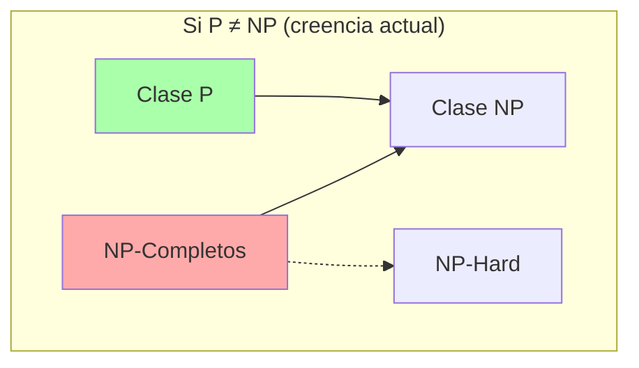

# Tema 7: Complejidad Computacional

Este tema aborda la clasificación de problemas según los recursos computacionales (tiempo y espacio) necesarios para resolverlos. Se centra en la distinción entre problemas tratables (clase P) e intratables (clase NP y NP-completos).

## 1. Conceptos Básicos

-   **Problema de Decisión:** Un problema cuya respuesta es siempre "SÍ" o "NO". La teoría de la complejidad se suele formular sobre problemas de decisión para simplificar el análisis.
-   **Instancia:** Un caso particular del problema con datos de entrada específicos.
-   **Algoritmo Eficiente:** Un algoritmo se considera eficiente si su tiempo de ejecución en el peor caso está acotado por un polinomio en función del tamaño de la entrada `n`. Es decir, `O(n^k)` para alguna constante `k`.

## 2. Clases de Complejidad

### Clase P (Polynomial Time)
Conjunto de problemas de decisión que pueden ser **resueltos** por una máquina de Turing determinista en tiempo polinómico.
-   Ejemplos: Ordenación, Búsqueda de caminos mínimos (Dijkstra), Árbol de expansión mínima (Prim, Kruskal), Prueba de primalidad (AKS).
-   Se asocian con problemas "fáciles" o "tratables".

### Clase NP (Nondeterministic Polynomial Time)
Conjunto de problemas de decisión para los cuales, si la respuesta es "SÍ", existe un certificado (o prueba) que puede ser **verificado** por una máquina de Turing determinista en tiempo polinómico.
-   Alternativamente: Problemas que pueden ser *resueltos* por una máquina de Turing *no determinista* en tiempo polinómico.
-   Ejemplos: Factorización de enteros, Problema del viajante (versión decisión), SAT, Sudoku.
-   **Importante:** `P ⊆ NP`. Todo problema que se puede resolver eficientemente también se puede verificar eficientemente.

### Relación entre P y NP
La pregunta del millón de dólares (literalmente) es: **¿P = NP?**
-   Si `P = NP`, significaría que para todo problema cuya solución podemos verificar rápidamente, también podemos encontrar esa solución rápidamente.
-   La creencia generalizada es que `P ≠ NP`, pero nadie lo ha demostrado aún.

## 3. Reducibilidad Polinómica

Una **reducción** es una forma de transformar un problema en otro.
Decimos que el problema `A` es reducible polinómicamente al problema `B` (denotado `A ≤p B`) si existe una función `f` computable en tiempo polinómico tal que para cualquier instancia `x` de `A`:
`x ∈ A ⇔ f(x) ∈ B`

**Implicación:** Si `A ≤p B`, entonces `B` es al menos tan difícil como `A` (salvo factores polinómicos). Si podemos resolver `B` eficientemente, podemos resolver `A` eficientemente.

## 4. NP-Completitud

La clase de los problemas **NP-Completos** (NPC) contiene los problemas más difíciles dentro de NP.
Un problema `X` es NP-completo si:
1.  `X ∈ NP` (es verificable en tiempo polinómico).
2.  Para todo problema `Y ∈ NP`, `Y ≤p X` (todo problema en NP se reduce a X).

**Propiedad fundamental:** Si se encontrara un algoritmo eficiente (polinómico) para cualquier problema NP-completo, entonces se habría demostrado que `P = NP`, ya que todos los problemas de NP podrían traducirse a ese problema y resolverse eficientemente.

### Ejemplos de Problemas NP-Completos
-   **SAT (Satisfacibilidad Booleana):** Primer problema demostrado NP-completo (Teorema de Cook-Levin). Dada una fórmula lógica, ¿existe una asignación de variables que la haga verdadera?
-   **3-SAT:** Variante de SAT donde las cláusulas tienen exactamente 3 literales.
-   **El Problema del Viajante (TSP - Decisión):** ¿Existe un recorrido que visite todas las ciudades con un coste total menor o igual a `K`?
-   **Mochila (Knapsack - Decisión):** ¿Se puede llenar la mochila obteniendo un valor al menos `V` sin superar el peso `W`?
-   **Coloración de Grafos:** ¿Se puede colorear un grafo con `k` colores tal que nodos adyacentes tengan distinto color?
-   **Clique:** ¿Contiene el grafo un subgrafo completo de tamaño `k`?

## 5. NP-Hard (NP-Duros)

Un problema es **NP-Hard** si cumple la segunda condición de NP-completitud (todo problema en NP se reduce a él), pero no necesariamente la primera (no tiene por qué estar en NP).
-   Son al menos tan difíciles como los problemas NP-completos.
-   Ejemplo: El problema de la parada (Halting Problem) es NP-Hard pero no NP (ni siquiera es decidible).

---

## Resumen Visual

Si un problema es NP-Completo, lo mejor que podemos hacer en la práctica (asumiendo P ≠ NP) es utilizar:
1.  **Algoritmos de Aproximación:** Encuentran soluciones cercanas a la óptima rápidamente.
2.  **Heurísticas/Metaheurísticas:** (Genéticos, Recocido Simulado) Buscan buenas soluciones sin garantías teóricas.
3.  **Algoritmos Exponenciales (Backtracking/B&B):** Para instancias pequeñas donde el tiempo de ejecución es aceptable.
