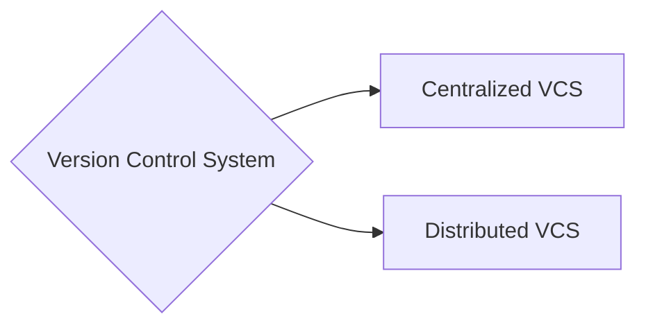

We as developers need a software that allow us to track versions on our code, that log the changes made trough every update. As a result of this CVCS (Centralized version control systems) born, but GIT isn't that. It is a **Distributed control version system**. 

So we have two different Version control systems (VCS).

Main differences:
>**GIT IS DISTRIBUTED VCS**
![[CVCS vs DVCS.png]] 
# CVCS vs DVCS: Update vs Pull

In CVCS **, developers do not** clone a full repository.  
They work with a *working copy* that is directly connected to a **single central repository**.

- Changes are committed **directly to the central server** so you need internet in order to commit
- To get others’ changes, developers use **update**
- There is **no pull operation**, because there is no local repository to synchronize
- The server is the single source of truth

In a **Distributed Version Control System (DVCS)** like Git, every developer has a **full local repository**

- Commits are created **locally**, without network access
- To receive changes, developers use **pull** (`fetch + merge`)
- Collaboration happens by synchronizing **local and remote repositories**
- The remote repository is just another copy, not a special one

**Key idea:**  
> In CVCS you update a working copy from a central repository;  
> in DVCS you pull changes between complete repositories.

---
# Working Copy vs Local Repository

### Working Copy
A **working copy** is a local view of the project files tied to the blobs commit, is extracting the files from a given commit(extracting their blobs which is the part of a commit that contains the files).

- Contains **only the current version** of the files (basically, by default, the blob's last commit of the repo that can be the central repo in the case of CVCS or the local repo with DVCS)
- **No full history** of commits
- Commits are sent **to the repository (Central or local)**

It is *not* a repository, just a checked-out snapshot you work on.

>note: **working copy** and **working tree** both refers to the same. Working tree It's just the preferred name given by GIT. 

### Local Repository
A **local repository** is a **complete copy of the repository**, including its full history.

- Contains **all commits, branches, and history**
- Commits are created **locally**
- Works fully **offline**
- Synchronizes with others using `push` and `pull`
- Typical of **DVCS** (e.g. Git)

It *is* a real repository, independent from any server.

### Key Difference (one sentence)
> A **working copy** is just a local snapshot connected to a central repo,  
> while a **local repository** is a full, standalone copy of the entire project history.

---
# Git Commit, Tree, and Blob Relationship

In Git, a **commit does not point to a single blob**.  
Instead, a commit points to a **tree object**, which represents the entire directory structure of the project at that point in time.

### Blob
- A **blob (Binary Large Object)** stores the **contents of a file**
- It does **not** store:
  - the file name
  - the file path
  - any metadata
- Each blob is uniquely identified by a hash of its content
- There is a Blob for each file in our project, obviously concluded for point 1.

### Tree
- A **tree** represents a directory
- It maps:
  - file names → blobs
  - subdirectories → other trees
- The root tree represents the full project structure

### Commit
- A **commit** points to:
  - one root tree
  - one or more parent commits
  - metadata (author, date, message)
## What happens when files change

- Each file in the repository has its **own blob**
- If a file is **modified**, Git creates a **new blob** for that file
- The tree that contains the file is updated to reference the new blob
- Files that **did not change** continue to reference their existing blobs
- A new commit is created pointing to the new root tree

This means Git **reuses blobs for unchanged files**, making it efficient and allowing every commit to represent a complete snapshot of the project.

![[Commit structure.png]]

>Note: As you can see in the image each commit has their own **hash** which is the identifier for each commit. There are Blobs for each files, if a file doesn't change from a commit to other it just take the last Blob for that file which is amazing for not repeating data (You can see this by looking at file summary_statistics.csv in **Second commit** and **Last commit** at the image, that file didn't change from commit 2 to commit 3). You can see that there's a tree that stores in a dictionary the name of each file and maps it to their corresponded content(blob). 
### Key idea

> A commit points to a tree, the tree maps files to blobs,  
> and only changed files produce new blobs while unchanged files are reused.

