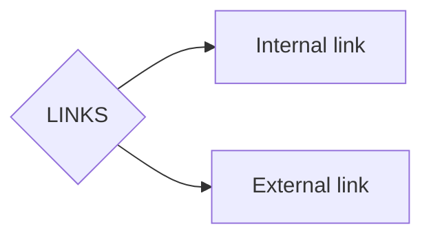

There are two possible links on obsidian.

- **Internal link** --> The links you establish between your `.md` files  
	- Syntaxis: \[[note name]]

- **External link** --> The links you establish with resources outside your vault. This can be the internet or resources on the internet
	- Syntaxis: \[link_name](https://help.obsidian.md/syntax#External+links)
	- [link_name](https://help.obsidian.md/syntax#External+links)